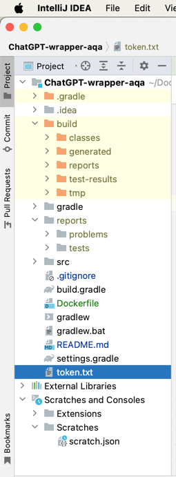

# UniverseApps - Test Task for QA Automation

## How to run
### Preconditions:
Add the token.txt file containing the Bearer Token to the root directory.



### Gradlew
To run using Gradlew, run the command
```shell
./gradlew test
```

To see the report, run the command 
```shell
open build/reports/tests/test/index.html
```

If the token.txt file is missing, an error will occur stating that the file cannot be found.

## Docker
To build a Docker image, run the following command
```shell
 docker build -t gradle-tests .     
```

After that, we can run this image by executing the following command
```shell
docker run --rm -v $(pwd)/<path_to_token>:/app/token.txt -v $(pwd)/build/reports:/app/build/reports gradle-tests
```
where path_to_token - path to file with token

Example command if the file ```token.txt``` is in the same directory
```shell
docker run --rm -v $(pwd)/token.txt:/app/token.txt -v $(pwd)/reports:/app/build/reports gradle-tests
```

After execution is complete, the report will be moved to the reports folder, and we can open it with the following command:
```shell
open reports/tests/test/index.html
```

## Scenarios description

### Single Message Test Cases
* Verify status code is 200 and response fields for valid request parameters
* Verify status code is 401 and error message for invalid Bearer Token
* Verify status code is 400 and error message for empty Messages parameter 

### Mocked Server Test Case
* Verify status code is 500 and error message for mocked Server

### Stream Test Cases
* Verify count of chunks bigger than zero
* Verify that last chunk has finish reason stop
* Verify that overall content has enough characters
* Verify that all chunks has the same Id

